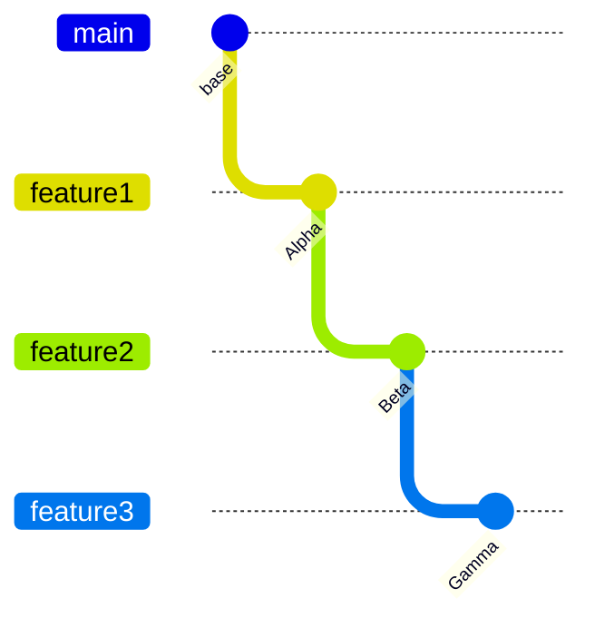

# git 技巧

- [ ] `git blame` 查看每行变动
- [ ] `git init --bare` 创建空仓库, 可作为远程仓库
- [ ] `git bisect` 二分查找提交历史, 查找哪一次提交破坏的单元测试
- [ ] `git rebase` 干净的提交历史
- [ ] `git add -p` 添加文件的部分改动
- [ ] `git log --all --graph --decorate` 查看树形提交
- [ ] `git add :/` 从根目录添加全部
- [ ] `git push [origin] [commit_id]:[remote_branch]` origin: 远程仓库名, commit_id: 提交 hash, remote_branch: 远程分支名
- [ ] `git push [origin] :[remote_branch]` origin: 远程仓库名, remote_branch: 远程分支名, 删除远程分支
- [ ] `git rebase --onto=[master] [server] [client]` client 在 server 之后的提交在 master 上重放
- [ ] `git reset origin/remote_branch --hard` 重置到远程分支 HEAD
- [ ] `git reset origin/remote_branch~ --hard` 重置到 commit_id
- [ ] `git commit --amend --date $(date -R)` 重新设置 commit date
- [ ] `origin/remote_branch` 只是远程分支头结点 commit_id 的引用
- [ ] `git checkout --[outs/theirs] PATH/FILE` resolve easy/obvious conflicts

## `git rebase`: options

- `--onto`: rebase 之后的 commit 开始位置
- `--keep-base`: `git rebase --keep-base <upstream> <branch>` 等于 `git base --onto <upstream> <upstream>`  
   `<upstream>`: 默认为上游分支, 也可能是任务有效提交 (maybe any valid commit)  
   `<branch>`: working branch; default to `HEAD`
- `--autosquash`: 在 `-i` 模式下, 如果 commit log 以 `squash! ...` | `fixup! ...` | `amend! ...` 开头  
   并且 `todo list` 中包含 commit 的 log 匹配 `...` 会自动修改 `todo list`  
   配合使用

  - `git commit --fixup=<commit>`
  - `git commit --fixup=amand:<commit>`
  - `git commit --fixup=reword:<commit>`
  - `git commit --squash=<commit>`

- `--root`: rebase from the branch root
- `-r, --rebase-merges=[=(rebase-cousins|no-rebase-cousins)]`: 保留 merge 节点

- `--no-keep-empty, --keep-empty`: 是否保留在 rebase 之前的 empty commit
- `--empty={drop,keep,ask}`: 是否保留 rebase 之前 not empty, rebase 之后 empty 的 commit

- `--committer-date-is-author-date`: 用 author date, 将启用 --force-rebase
- `--ignore-date, --reset-author-date`: 用 current time, 将启用 --force-rebase

## split a subdirectory to a new git repo and keep the history

```
git checkout [your_branch_name]
git filter-branch --prune-empty --subdirectory-filter relative/path/to/subdirectory [your_current_branch_name]
git remote --set-url origin https://github.com/...
git push -u origin [your_branch_name]

```

or

```
git filter-repo --path path/subpath
```

> from [blog](https://ao.ms/how-to-split-a-subdirectory-to-a-new-git-repository-and-keep-the-history/)

> another [github docs](https://docs.github.com/en/get-started/using-git/splitting-a-subfolder-out-into-a-new-repository)

## git clean the reflog and git unreachable commit

```
git reflog expire --expire-unreachable=now --all
git gc --prune=now
```

> from [stackoverflow](https://stackoverflow.com/questions/1904860/how-to-remove-unreferenced-blobs-from-my-git-repository)

## gpg sign old commits

```
git filter-branch --commit-filter 'git commit-tree -S "$@";' <COMMIT>..HEAD
```

> from [stackoverflow](https://superuser.com/questions/397149/can-you-gpg-sign-old-commits)

## git rev-parse

`git rev-parse --help`

- 获取 SHA1 (OID)

## git 获取当前分支名

- `git branch --show-current`
- `git name-rev --name-only HEAD`
- `git symbolic-ref --short HEAD`
- `git rev-parse --abbrev-ref HEAD`

> from [stackoverflow](https://stackoverflow.com/questions/6245570/how-do-i-get-the-current-branch-name-in-git)

## 远程当前分支的名称

`git name-rev --name-only @{u}`

## reset 到远程分支节点

`git reset @{u}`

## push 到远程同名分支

- `git push origin HEAD`

- `git config push.default current`

> from [stackoverflow](https://stackoverflow.com/questions/948354/default-behavior-of-git-push-without-a-branch-specified)
> from [stackoverflow](https://stackoverflow.com/questions/14031970/git-push-current-branch-shortcut/20922141#20922141)

## revision range

- `^<rev>`: exclude commit that are reachable from `<rev>`
- `<rev1>..<rev2>`: `^<rev1> <rev2>`, reachable from `<rev2>` but exclude those that reachable from `<rev1>`
- `<rev1>...<rev2>`: reachable from either `<rev1>` or `<rev2>` but exclude those that reachable from both
- `<rev>^^-<n>`: `<rev>^<n>...<rev>`

## partial clone

- `git clone --filter=blob:none <url>`: blobless
- `git clone --filter=tree:0 <url>`: treeless

> from [github blog](https://github.blog/2020-12-21-get-up-to-speed-with-partial-clone-and-shallow-clone/)

## 仓库镜像

- 使用 `ssh` 替换 `https://`

```sh
git config --global url."git@github.com:".insteadOf "https://github.com/"
```

> from [github gist](https://gist.github.com/Kovrinic/ea5e7123ab5c97d451804ea222ecd78a)

## git 还原所有空白修改

```sh
git diff -w --ignore-blank-lines > temp.patch
git restore :/
git apply temp.patch
```

> Warning: 做好备份, 谨慎使用, 有可能使更改丢失

## git 列出所有修改且存在的文件

```sh
git status --short | awk `$1=="M"||$1=="A" {print $2} $1=="R" {print $4}`
```

## git rebase --update-refs

--udpate-refs 选项可以确保使用 git rebase 后, 相关的引用也会被更新



```
git switch feature3
git rebase main --update-refs
```

it will update all refs for branch feature1 feature2 feature3

## git worktree

可以同时检出多个分支，每个分支有自己的目录

## git log -L 查看指定范围内的提交历史中文件的变更情况

```
# git log -L <start>,<end>:<file>
# <start> and <end> 可用形式
# number: 表示文件中的绝对行号
# /regex/: 从上一个 -L 结束开始搜索
# ^/regex/: 从文件开头开始搜索
# +offset or -offset: 只对 <end> 有效
git log -L 10,20:example.txt

# git log -L :<funcname>:<file>
# `:<funcname>`: 匹配函数开始和结束的表达式, 同样从上一个 -L 结束开始搜索
# `^:<funcname>`: 匹配函数开始和结束的表达式, 从文件头开始搜索
git log -L :date_format:util.rs
```

## git diff

### git diff --word-diff

按单词 diff 显示差别, 对于 tailwindcss 用户特别有用

### git diff -S<string>

精确搜索 `<string>` 次数变更的提交

### git diff -S<regex> --pickaxe-regex

匹配搜索 `<regex>` 次数变更的提交

### git diff -G<regex>

匹配搜索添加/删除的行包含 `<regex>` 的提交, 注意与 `git diff -S<regex>> --pickaxe-regex` 的区别

### git diff --diff-filter=[(A|C|D|M|R|T|U|X|B)...[*]]

大写包含(include), 小写不包含(exclude)

### git diff 忽略空白

- `--ignore-cr-at-eol`
- `--ignore-space-at-eol`
- `-b, --ignore-space-change`
- `-w, --ignore-all-space`
- `-I<regex>, --ignore-matching-lines=<regex>`
  Ignore changes whose all lines match <regex>.

### git diff -W

> Show whole function as context lines for each change.

change 的上下文中显示整个函数

## git config --global rerere.enable true

> REuse REcorded REsolution

`rebase` 过程中的相同冲突只解决一次

## git maintenance start

自动维护大型仓库, 使在大型仓库上的操作变快

## scalar: git

- prefetching
- commit-graph
- filesystem monitor
- partial cloning
- sparse checkout

## 新建分支时取消自动设置 upstream

`branch.autoSetupMerge` 默认为 `true`, 当新建分支时若起始分支为远程分支时, 会自动设置远程分支为 track

修改为 `simple`, 仅当起始分支为远程分支且与本地分支同名时才设置

```sh
git config --global branch.autoSetupMerge simple`
```

或在配置文件中添加如下内容

```
[branch]
    ; default option is `true`, will auto set track branch
    ; when starting point is a remote-tracking branch
    autoSetupMerge = simple
```

## find-merge vs merge-base

find-merge 是查找两节点之后的合并节点，merge-base 是查找两节点前的最近公共祖先节点

## 参考

- [So You Think You Know Git? Part 1](https://www.youtube.com/watch?v=aolI_Rz0ZqY)
- [So You Think You Know Git? Part 2](https://www.youtube.com/watch?v=Md44rcw13k4)
