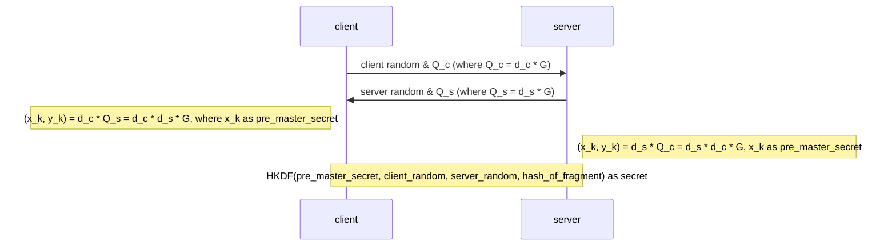

# 初识 TLS 1.3

| date       | tag       |
| ---------- | --------- |
| 2022-11-17 | TLS/HTTPS |

## 密钥交换生成过程

1. 通过 [ECDHE](https://en.wikipedia.org/wiki/Elliptic-curve_Diffie%E2%80%93Hellman) 交换双方公钥

   a. 双方生成私钥, 通过私钥和协商的椭圆曲线计算各自公钥并传输交换

   b. 通过私钥和对方公钥计算出协商密钥 (`pre_master_secret`)

2. 通过 [HKDF](https://en.wikipedia.org/wiki/HKDF) 算法利用双方生成的随机数、`pre_master_secret`、握手阶段报文的哈希值生成随机性更强的传输密钥

## 参考

- [原文](https://web.archive.org/web/20221117062205/https://mdnice.com/writing/138185b5b5a1428bb59022a33082d68f)

## 优秀文章

- [椭圆曲线加密](https://fangpenlin.com/posts/2019/10/07/elliptic-curve-cryptography-explained/)
